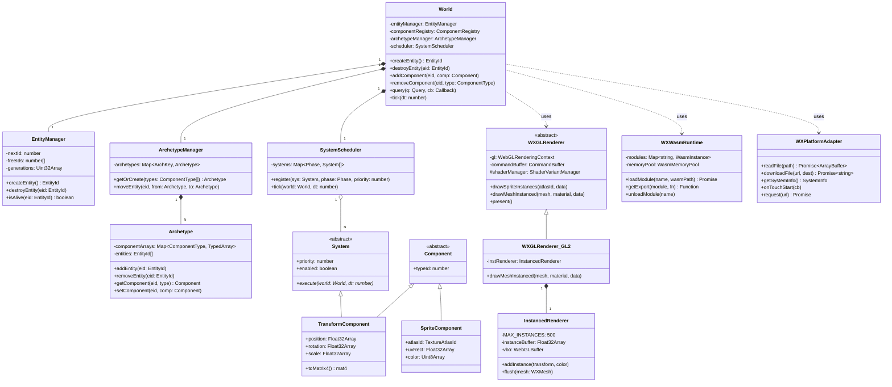
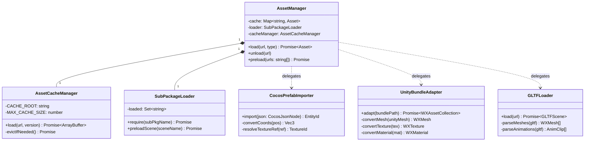

# 微信小游戏专用 Runtime 引擎设计文档

> **版本：** v1.0.0  
> **状态：** 架构设计草案  
> **目标读者：** 游戏引擎开发者、Claude AI 审阅  
> **平台约束：** 微信小游戏基础库 ≥ 2.x，主包 ≤ 4MB，总包 ≤ 30MB

---

## 目录

1. [概述与设计目标](#1-概述与设计目标)
2. [整体模块架构](#2-整体模块架构)
3. [WASM 运行时模块](#3-wasm-运行时模块)
4. [原生 WebGL 渲染适配层](#4-原生-webgl-渲染适配层)
5. [ECS 实体组件系统](#5-ecs-实体组件系统)
6. [微信 API 适配层](#6-微信-api-适配层)
7. [导出解析与导入工具](#7-导出解析与导入工具)
8. [性能监控与优化模块](#8-性能监控与优化模块)
9. [子域与包大小优化](#9-子域与包大小优化)
10. [模块交互流程图](#10-模块交互流程图)
11. [关键伪代码示例](#11-关键伪代码示例)
12. [UML 类图](#12-uml-类图)
13. [附录：技术约束速查表](#13-附录技术约束速查表)

---

## 1. 概述与设计目标

### 1.1 背景

微信小游戏运行于受限的 JavaScript 沙箱环境（WXJSCore），不支持 DOM、不支持 `new Function`、不支持多线程（Web Worker 受限）。现有跨平台引擎（Unity、Cocos Creator）均需经过适配层才能运行。

本引擎（代号 **WX-RT**）旨在提供一套面向微信小游戏平台的原生 Runtime，直接对接平台底层，最大化利用 WASM + WebGL 2.0 的性能空间，同时兼容从 Cocos Creator / Unity 导出的资产格式。

### 1.2 核心设计原则

| 原则 | 说明 |
|------|------|
| **零 DOM 依赖** | 所有渲染通过 `wx.createCanvas()` + WebGL 上下文实现，不依赖任何 HTML 元素 |
| **包体优先** | 主包目标 ≤ 3MB，引擎核心 WASM 分离至子包，按需异步加载 |
| **数据导向** | 渲染与逻辑均基于 ECS + SoA（Structure of Arrays）内存布局，提升 CPU 缓存命中率 |
| **平台隔离** | 所有微信 API 调用通过适配层代理，便于跨平台替换与单元测试 |
| **GC 可控** | 提供显式对象池与 GC 控制接口，避免 JS 垃圾回收导致的帧率抖动 |

### 1.3 平台硬性约束

```
主包大小:         ≤ 4MB（目标 ≤ 3MB）
总包大小:         ≤ 30MB（开通虚拟支付）
单个普通分包:     无限制（受总量约束）
单个独立分包:     ≤ 4MB
文件系统缓存:     ≤ 200MB（申请后可达 1GB）
WebGL 版本:       WebGL 1.0 / 2.0（Android ≥ 8.0.24 支持 WebGL2）
WASM:             支持 WXWebAssembly（禁止动态代码生成）
多线程:           不支持 SharedArrayBuffer，Worker 受限
```

---

## 2. 整体模块架构

### 2.1 分层架构总览

```
┌─────────────────────────────────────────────────────────────────────┐
│                        游戏业务层 (Game Logic)                       │
│                    (TypeScript / Lua 脚本代码)                       │
└──────────────────────────────┬──────────────────────────────────────┘
                               │
┌──────────────────────────────▼──────────────────────────────────────┐
│                      WX-RT 引擎核心层                                │
│  ┌─────────────┐  ┌──────────────┐  ┌──────────────────────────┐   │
│  │  ECS 系统   │  │ 场景管理器   │  │    资源管理器 (ResMan)    │   │
│  │  (实体/组件/│  │ (SceneGraph) │  │  AssetBundle / 分包加载  │   │
│  │   调度器)   │  └──────────────┘  └──────────────────────────┘   │
│  └─────────────┘                                                     │
└──────┬───────────────────────┬──────────────────┬───────────────────┘
       │                       │                  │
┌──────▼──────┐  ┌─────────────▼──────┐  ┌───────▼───────────────────┐
│  WASM 运行时 │  │  WebGL 渲染适配层   │  │    微信 API 适配层         │
│  (WXRuntime) │  │  (WXGLRenderer)    │  │    (WXPlatformAdapter)    │
│             │  │  - 实例化渲染       │  │  - 音频 / 输入 / 网络     │
│  C++/Rust → │  │  - Shader 管理      │  │  - 文件系统 / 登录        │
│  .wasm 模块  │  │  - Draw Call 合批  │  │  - 子域 OpenDataContext   │
└──────┬──────┘  └─────────────┬──────┘  └───────┬───────────────────┘
       │                       │                  │
┌──────▼───────────────────────▼──────────────────▼───────────────────┐
│                    微信小游戏底层 API                                  │
│     WXWebAssembly   wx.createCanvas   wx.getSystemInfoSync etc.      │
└─────────────────────────────────────────────────────────────────────┘
```

### 2.2 启动流程概览

```
game.js (主包入口, ≤ 4MB)
   │
   ├── 初始化 WXPlatformAdapter（同步）
   ├── 创建 WebGL Canvas 上下文
   ├── 异步加载 engine-core.wasm（子包）
   │      └── WXWebAssembly.instantiate(...)
   ├── 初始化 WXGLRenderer
   ├── 初始化 ECS World
   ├── 异步加载游戏分包资源
   └── 进入主循环 requestAnimationFrame
```

---

## 3. WASM 运行时模块

### 3.1 设计目标

将计算密集型逻辑（物理模拟、寻路、骨骼动画蒙皮）编译为 WASM，通过 `WXWebAssembly` 接口加载，绕过 JS JIT 限制，获取接近原生的性能。

> **关键约束**：微信小游戏禁止 `new Function`、`eval` 等动态代码执行 API。Emscripten 编译时必须加 `-s NO_DYNAMIC_EXECUTION=1` 标志。

### 3.2 模块结构

```
wasm/
├── physics/          # 物理引擎（Box2D-WASM / Bullet-lite）
├── pathfinding/      # A* / NavMesh（RVO2 避障）
├── skinning/         # GPU 骨骼蒙皮预处理
├── audio-dsp/        # 音频 DSP 滤波器
└── math-simd/        # SIMD 向量/矩阵运算（WASM 2.0 向量指令）
```

### 3.3 WASM 生命周期管理

```typescript
// wasm-runtime.ts
class WXWasmRuntime {
  private modules: Map<string, WebAssembly.Instance> = new Map();
  private memoryPool: WasmMemoryPool;

  async loadModule(name: string, wasmPath: string): Promise<void> {
    // 使用 WXWebAssembly 替代标准 WebAssembly
    const response = await wx.downloadFile({ url: wasmPath });
    const buffer   = await this.readFileAsBuffer(response.tempFilePath);

    const result = await WXWebAssembly.instantiate(buffer, {
      env: {
        memory: this.memoryPool.getSharedMemory(),
        __stack_pointer: new WebAssembly.Global({ value: 'i32', mutable: true }, 0),
        emscripten_notify_memory_growth: () => { this.memoryPool.onGrowth(); }
      }
    });

    this.modules.set(name, result.instance);
  }

  getExport<T>(moduleName: string, fnName: string): T {
    const mod = this.modules.get(moduleName);
    if (!mod) throw new Error(`WASM module '${moduleName}' not loaded`);
    return mod.exports[fnName] as T;
  }

  unloadModule(name: string): void {
    this.modules.delete(name);
    this.memoryPool.compact();  // 触发内存整理
  }
}
```

### 3.4 WASM 内存池设计

```
┌────────────────────────────────────────────┐
│              WasmMemoryPool                │
│  ┌──────────────┐  ┌──────────────────┐   │
│  │  Static Pool │  │  Dynamic Pool    │   │
│  │  (固定大小)   │  │  (按需扩展)      │   │
│  │  physics     │  │  temp buffers    │   │
│  │  skinning    │  │  string interop  │   │
│  └──────────────┘  └──────────────────┘   │
│                                            │
│  总大小: Android ≤ 512MB, iOS ≤ 256MB     │
└────────────────────────────────────────────┘
```

---

## 4. 原生 WebGL 渲染适配层

### 4.1 架构概述

渲染层封装 WebGL 1.0 / 2.0 双模式，在运行时根据设备能力自动选择。核心设计为 **命令缓冲区（Command Buffer）** 模式，将渲染指令序列化后批量提交，减少 JS↔GPU 通信开销。

### 4.2 渲染器类层次

```
WXGLRenderer (抽象基类)
├── WXGLRenderer_GL1   (WebGL 1.0 后备实现)
└── WXGLRenderer_GL2   (WebGL 2.0 主实现)
      ├── InstancedRenderer     (GPU 实例化渲染)
      ├── SpriteRenderer        (2D 精灵批处理)
      └── ShadowMapRenderer     (阴影贴图)
```

### 4.3 WebGL 上下文初始化

```typescript
class WXGLContextFactory {
  static create(canvas: WXCanvas): WXGLRenderer {
    // 优先尝试 WebGL 2.0
    let gl = canvas.getContext('webgl2', {
      antialias: false,         // 移动端禁用抗锯齿节省带宽
      alpha: false,
      depth: true,
      stencil: false,
      premultipliedAlpha: false,
      preserveDrawingBuffer: false  // 避免额外内存复制
    });

    if (gl) {
      console.log('[WX-RT] WebGL 2.0 context acquired');
      return new WXGLRenderer_GL2(gl as WebGL2RenderingContext);
    }

    // 降级至 WebGL 1.0
    gl = canvas.getContext('webgl');
    console.warn('[WX-RT] Fallback to WebGL 1.0');
    return new WXGLRenderer_GL1(gl as WebGLRenderingContext);
  }
}
```

### 4.4 GPU 实例化渲染（Instanced Rendering）

实例化渲染是微信小游戏性能优化的核心手段，可将相同 Mesh 的数百个 Draw Call 合并为 1 次。

#### 4.4.1 实例数据布局（SoA 格式）

```
InstanceBuffer (Float32Array, Stride = 80 bytes per instance)
┌─────────────┬────────────────┬───────────────┬──────────────┐
│ ModelMatrix │   Color(RGBA)  │  UV Offset    │  Custom Data │
│  (64 bytes) │   (16 bytes)   │  (8 bytes? )  │  (8 bytes)   │
│  mat4       │   vec4         │  vec2,vec2    │  userData    │
└─────────────┴────────────────┴───────────────┴──────────────┘
```

#### 4.4.2 实例渲染器核心实现

```typescript
class InstancedRenderer {
  private readonly MAX_INSTANCES = 500;  // iOS 安全上限，防止 uniform 溢出
  private instanceBuffer: Float32Array;
  private vbo: WebGLBuffer;
  private instanceCount = 0;

  constructor(private gl: WebGL2RenderingContext) {
    // 分配 CPU 端实例数据缓冲区
    this.instanceBuffer = new Float32Array(this.MAX_INSTANCES * 20); // 20 floats/instance
    this.vbo = gl.createBuffer()!;
    gl.bindBuffer(gl.ARRAY_BUFFER, this.vbo);
    gl.bufferData(gl.ARRAY_BUFFER, this.instanceBuffer.byteLength, gl.DYNAMIC_DRAW);
    this.setupInstanceAttribs();
  }

  private setupInstanceAttribs(): void {
    const gl = this.gl;
    const INSTANCE_ATTRIB_LOC = 4; // layout location 4-7 for mat4

    for (let col = 0; col < 4; col++) {
      const loc = INSTANCE_ATTRIB_LOC + col;
      gl.enableVertexAttribArray(loc);
      gl.vertexAttribPointer(loc, 4, gl.FLOAT, false, 80, col * 16);
      gl.vertexAttribDivisor(loc, 1);  // WebGL 2.0: per-instance advance
    }
    // Color attrib
    gl.enableVertexAttribArray(8);
    gl.vertexAttribPointer(8, 4, gl.FLOAT, false, 80, 64);
    gl.vertexAttribDivisor(8, 1);
  }

  addInstance(transform: mat4, color: vec4): boolean {
    if (this.instanceCount >= this.MAX_INSTANCES) return false;
    const offset = this.instanceCount * 20;
    this.instanceBuffer.set(transform, offset);
    this.instanceBuffer.set(color, offset + 16);
    this.instanceCount++;
    return true;
  }

  flush(mesh: WXMesh): void {
    if (this.instanceCount === 0) return;
    const gl = this.gl;

    // 上传实例数据（仅更新使用部分）
    gl.bindBuffer(gl.ARRAY_BUFFER, this.vbo);
    gl.bufferSubData(gl.ARRAY_BUFFER, 0,
      this.instanceBuffer.subarray(0, this.instanceCount * 20));

    // 单次 Draw Call 渲染所有实例
    gl.drawElementsInstanced(
      gl.TRIANGLES,
      mesh.indexCount,
      gl.UNSIGNED_SHORT,
      0,
      this.instanceCount
    );

    this.instanceCount = 0;  // 重置计数器
  }
}
```

### 4.5 Shader 管理与变体系统

```typescript
class ShaderVariantManager {
  private cache: Map<string, WebGLProgram> = new Map();

  getVariant(baseName: string, defines: string[]): WebGLProgram {
    const key = baseName + '|' + defines.sort().join('|');
    if (this.cache.has(key)) return this.cache.get(key)!;

    const program = this.compileVariant(baseName, defines);
    this.cache.set(key, program);
    return program;
  }

  private compileVariant(baseName: string, defines: string[]): WebGLProgram {
    const header = defines.map(d => `#define ${d} 1`).join('\n');
    const vert   = header + '\n' + ShaderLibrary.getVert(baseName);
    const frag   = header + '\n' + ShaderLibrary.getFrag(baseName);
    return GLUtils.compileProgram(this.gl, vert, frag);
  }
}
```

### 4.6 渲染命令缓冲区

```
每帧渲染流程：

ECS RenderSystem
      │
      ▼ 收集渲染命令
 CommandBuffer
  ├── SetCamera(VP matrix)
  ├── SetRenderTarget(FBO or screen)
  ├── DrawInstanced(meshId, materialId, instanceData[])
  ├── DrawSprite(texId, rect, color)
  └── Blit(srcTex, dstTex, shader)
      │
      ▼ 排序（按材质/深度）
 SortedCommandList
      │
      ▼ 提交至 GPU
 WXGLRenderer.execute(commands)
```

---

## 5. ECS 实体组件系统

### 5.1 设计哲学

采用 **Archetype 原型** 模式（类似 Unity DOTS / Bevy ECS），将相同组件组合的实体存储在连续内存中，最大化 CPU 缓存效率。

```
传统 OOP 内存布局（低效）:
Entity0: [Transform][Sprite][Physics]  ←── 散布在堆内存各处
Entity1: [Transform][Sprite]
Entity2: [Transform][Physics]

Archetype SoA 布局（高效）:
Archetype(Transform+Sprite):
  transforms: [T0, T1, T2, T3, ...]   ←── 连续内存，Cache 友好
  sprites:    [S0, S1, S2, S3, ...]

Archetype(Transform+Physics):
  transforms: [T4, T5, ...]
  physics:    [P4, P5, ...]
```

### 5.2 核心 ECS 模块

#### 5.2.1 实体管理器

```typescript
class EntityManager {
  private nextId = 1;
  private freeIds: number[] = [];       // 回收的 ID 复用池
  private generations: Uint32Array;     // 代际版本，防止 dangling reference
  private entityArchetypes: Map<number, Archetype> = new Map();

  createEntity(): EntityId {
    const id   = this.freeIds.length > 0 ? this.freeIds.pop()! : this.nextId++;
    const gen  = ++this.generations[id];
    return EntityId.pack(id, gen);  // 高16位=generation，低16位=index
  }

  destroyEntity(eid: EntityId): void {
    const index = EntityId.index(eid);
    this.generations[index]++;          // 递增代际，使旧引用失效
    this.entityArchetypes.delete(index);
    this.freeIds.push(index);
  }

  isAlive(eid: EntityId): boolean {
    const index = EntityId.index(eid);
    return this.generations[index] === EntityId.generation(eid);
  }

  addComponent<T extends Component>(eid: EntityId, comp: T): void {
    const arch = this.getOrCreateArchetype(eid, comp.constructor as ComponentType<T>);
    arch.setComponent(eid, comp);
  }
}
```

#### 5.2.2 组件存储（SoA TypedArray）

```typescript
// 组件基类：纯数据，无方法
abstract class Component {
  abstract readonly typeId: number;
}

// Transform 组件：使用 Float32Array 紧凑存储
class TransformStorage {
  // 每实体 10 个 float: px,py,pz + rx,ry,rz + sx,sy,sz + pad
  private data: Float32Array;
  private capacity: number;

  constructor(initialCapacity = 1024) {
    this.capacity = initialCapacity;
    this.data = new Float32Array(initialCapacity * 10);
  }

  get(index: number): TransformData {
    const base = index * 10;
    return {
      position: this.data.subarray(base, base + 3),
      rotation: this.data.subarray(base + 3, base + 6),
      scale:    this.data.subarray(base + 6, base + 9)
    };
  }

  set(index: number, t: TransformData): void {
    const base = index * 10;
    this.data[base]     = t.position[0];
    this.data[base + 1] = t.position[1];
    this.data[base + 2] = t.position[2];
    // ... rotation, scale
  }

  grow(): void {
    this.capacity *= 2;
    const next = new Float32Array(this.capacity * 10);
    next.set(this.data);
    this.data = next;
  }
}
```

#### 5.2.3 系统调度器

```typescript
class SystemScheduler {
  private systems: Map<Phase, System[]> = new Map();

  // 执行阶段枚举
  static Phases = {
    PreUpdate:  0,  // 输入处理、网络同步
    Update:     1,  // 游戏逻辑
    LateUpdate: 2,  // 相机跟随、IK 后处理
    PreRender:  3,  // 动画、Culling
    Render:     4,  // 渲染命令生成
    PostRender: 5,  // 后处理、UI
  };

  register(system: System, phase: Phase, priority = 0): void {
    if (!this.systems.has(phase)) this.systems.set(phase, []);
    const list = this.systems.get(phase)!;
    list.push(system);
    list.sort((a, b) => a.priority - b.priority);
  }

  tick(world: World, deltaTime: number): void {
    for (const phase of Object.values(SystemScheduler.Phases)) {
      const systems = this.systems.get(phase) ?? [];
      for (const sys of systems) {
        if (sys.enabled) {
          sys.execute(world, deltaTime);
        }
      }
    }
  }
}
```

#### 5.2.4 查询接口（Query API）

```typescript
// 声明式查询：系统只处理拥有特定组件组合的实体
class MovementSystem extends System {
  // 查询：必须有 Transform + Velocity 组件，不能有 Frozen 标签组件
  private query = new Query()
    .with(TransformComponent)
    .with(VelocityComponent)
    .without(FrozenTag);

  execute(world: World, dt: number): void {
    // 遍历匹配实体（数据连续，Cache 命中率高）
    world.query(this.query, (eid, transform, velocity) => {
      transform.position[0] += velocity.vx * dt;
      transform.position[1] += velocity.vy * dt;
      transform.position[2] += velocity.vz * dt;
    });
  }
}
```

### 5.3 ECS 模块交互图

```
┌──────────────────────────────────────────────────────────────┐
│                        ECS World                             │
│                                                              │
│  EntityManager          ComponentRegistry                    │
│  ┌─────────────┐       ┌────────────────────────────┐       │
│  │ createEntity│       │ TransformStorage (F32Array) │       │
│  │ destroyEntity│◄────►│ VelocityStorage  (F32Array) │       │
│  │ isAlive     │       │ SpriteStorage    (U32Array) │       │
│  └─────────────┘       │ PhysicsStorage   (F32Array) │       │
│         │              └────────────────────────────┘       │
│         ▼                          ▲                         │
│  ArchetypeManager                  │                         │
│  ┌─────────────────┐              │                         │
│  │ Archetype[T+S]  │──────────────┘                         │
│  │ Archetype[T+P]  │  提供连续内存块                         │
│  │ Archetype[T+S+P]│                                         │
│  └─────────────────┘                                         │
│         │                                                    │
│         ▼                                                    │
│  SystemScheduler                                             │
│  ┌──────────────────────────────────┐                       │
│  │ PreUpdate  → InputSystem         │                       │
│  │ Update     → MovementSystem      │                       │
│  │             PhysicsSystem        │                       │
│  │             AISystem             │                       │
│  │ LateUpdate → CameraSystem        │                       │
│  │ PreRender  → AnimationSystem     │                       │
│  │             FrustumCullSystem    │                       │
│  │ Render     → RenderSystem ───────┼──► WXGLRenderer      │
│  └──────────────────────────────────┘                       │
└──────────────────────────────────────────────────────────────┘
```

---

## 6. 微信 API 适配层

### 6.1 设计目标

将微信专有 API（`wx.*`）封装为平台无关的接口，使引擎核心逻辑不直接依赖微信 API，便于在 PC 模拟器和其他平台进行单元测试。

### 6.2 适配层接口定义

```typescript
// 平台无关接口
interface IPlatformAdapter {
  // 文件系统
  readFile(path: string): Promise<ArrayBuffer>;
  writeFile(path: string, data: ArrayBuffer): Promise<void>;
  
  // 网络
  request(url: string, method: string, data?: any): Promise<any>;
  downloadFile(url: string, dest: string): Promise<string>;
  
  // 音频
  createAudioContext(): IAudioContext;
  
  // 输入
  onTouchStart(cb: TouchCallback): void;
  onTouchMove(cb: TouchCallback): void;
  onTouchEnd(cb: TouchCallback): void;
  
  // 系统信息
  getSystemInfo(): SystemInfo;
  
  // 存储
  getStorage(key: string): any;
  setStorage(key: string, value: any): void;
  
  // 社交/开放能力
  login(): Promise<LoginResult>;
  getUserInfo(): Promise<UserInfo>;
}

// 微信实现
class WXPlatformAdapter implements IPlatformAdapter {
  readFile(path: string): Promise<ArrayBuffer> {
    return new Promise((resolve, reject) => {
      const fs = wx.getFileSystemManager();
      fs.readFile({
        filePath: path,
        success: res => resolve(res.data as ArrayBuffer),
        fail: err => reject(err)
      });
    });
  }

  downloadFile(url: string, dest: string): Promise<string> {
    return new Promise((resolve, reject) => {
      wx.downloadFile({
        url,
        filePath: wx.env.USER_DATA_PATH + '/' + dest,
        success: res => resolve(res.filePath),
        fail: reject
      });
    });
  }

  getSystemInfo(): SystemInfo {
    const info = wx.getSystemInfoSync();
    return {
      platform:       info.platform,
      pixelRatio:     info.pixelRatio,
      screenWidth:    info.screenWidth,
      screenHeight:   info.screenHeight,
      system:         info.system,
      brand:          info.brand,
      model:          info.model,
      isAndroid:      info.platform === 'android',
      isIOS:          info.platform === 'ios',
    };
  }
  // ... 其他接口实现
}

// 测试模拟实现（用于 PC 开发调试）
class MockPlatformAdapter implements IPlatformAdapter {
  async readFile(path: string): Promise<ArrayBuffer> {
    const resp = await fetch(path);
    return resp.arrayBuffer();
  }
  // ...
}
```

### 6.3 子域（OpenDataContext）通信桥

微信开放数据域（子域）是独立的 JS 沙箱，只能通过 `sharedCanvas` 单向渲染，双向通信通过 `postMessage` 实现。

```typescript
// 主域端：子域代理
class OpenDataContextBridge {
  private ctx: WXOpenDataContext;
  private sharedCanvas: WXCanvas;
  private sharedTexture: WebGLTexture;

  constructor(private gl: WebGLRenderingContext) {
    this.ctx = wx.getOpenDataContext();
    this.sharedCanvas = this.ctx.canvas;
    this.sharedTexture = gl.createTexture()!;
  }

  // 发送消息至子域
  postMessage(msg: object): void {
    this.ctx.postMessage(msg);
  }

  // 每帧同步子域渲染结果至主域纹理
  syncFrame(): void {
    const gl = this.gl;
    gl.bindTexture(gl.TEXTURE_2D, this.sharedTexture);
    // 将共享 Canvas 内容上传为纹理（真机有效）
    (gl as any).texImage2D(
      gl.TEXTURE_2D, 0, gl.RGBA, gl.RGBA,
      gl.UNSIGNED_BYTE, this.sharedCanvas
    );
  }
}

// 子域端：排行榜逻辑（完全独立的沙箱）
// open-data-context/index.js
wx.onMessage(data => {
  if (data.type === 'GET_FRIEND_RANK') {
    wx.getFriendCloudStorage({
      keyList: ['score'],
      success: res => {
        renderLeaderboard(res.data);  // 绘制到 sharedCanvas
      }
    });
  }
});
```

---

## 7. 导出解析与导入工具

### 7.1 支持格式矩阵

| 来源引擎 | 支持的导出格式 | 解析模块 | 备注 |
|---------|------------|---------|------|
| Unity | `.bundle` (AssetBundle) | `UnityBundleParser` | 需解包 CAB 格式 |
| Unity | WebGL Build (`*.data`, `*.wasm`) | `UnityWebGLAdapter` | 官方转换工具辅助 |
| Cocos Creator | `.pak` (Asset Bundle) | `CocosPackParser` | JSON Meta + 二进制资产 |
| Cocos Creator | `.prefab` (JSON) | `CocosPrefabImporter` | 递归解析节点树 |
| 通用 | `.gltf` / `.glb` | `GLTFLoader` | 标准格式，优先推荐 |
| 通用 | `.fbx` (预处理后) | `FBXPreprocessor` | 离线转换为 glTF |

### 7.2 导入流水线

```
原始资产 (Unity/Cocos 格式)
      │
      ▼
[解析器 Parser]          ← 读取二进制格式，提取 Mesh/Tex/Anim 数据
      │
      ▼
[规范化器 Normalizer]    ← 转换为 WX-RT 内部格式（坐标系/材质模型统一）
      │
      ▼
[优化器 Optimizer]       ← 压缩纹理(ETC2/ASTC)，简化 Mesh，合并 Atlas
      │
      ▼
[打包器 Packer]          ← 按场景/功能分包，生成分包 manifest
      │
      ▼
WX-RT 运行时可加载格式 (.wxpak)
```

### 7.3 Cocos Creator 场景解析器

```typescript
class CocosPrefabImporter {
  import(jsonData: CocosJsonNode): WXEntity {
    const world = this.world;
    const eid = world.createEntity();

    // 解析 Transform
    const t = jsonData._components?.find(c => c.__type__ === 'cc.UITransform');
    if (t) {
      world.addComponent(eid, new TransformComponent({
        position: this.convertCoords(jsonData.position),  // Y 轴翻转
        rotation: jsonData.eulerAngles,
        scale:    jsonData.scale
      }));
    }

    // 解析 Sprite 组件
    const sprite = jsonData._components?.find(c => c.__type__ === 'cc.Sprite');
    if (sprite) {
      world.addComponent(eid, new SpriteComponent({
        textureId: this.resolveTextureRef(sprite.spriteFrame),
        color:     sprite.color,
        type:      sprite.type  // Simple / Sliced / Tiled
      }));
    }

    // 递归处理子节点
    for (const child of jsonData.children ?? []) {
      const childEid = this.import(child);
      world.setParent(childEid, eid);
    }

    return eid;
  }

  private convertCoords(pos: CocosVec3): Vec3 {
    // Cocos 与 WebGL 坐标系差异：Y 轴方向不同
    return { x: pos.x, y: -pos.y, z: pos.z };
  }
}
```

### 7.4 Unity AssetBundle 适配

```typescript
class UnityBundleAdapter {
  // Unity WebGL 导出的资产通过此适配器对接 WX-RT
  async adapt(bundlePath: string): Promise<WXAssetCollection> {
    const raw = await this.platform.readFile(bundlePath);
    const bundle = UnityBundleParser.parse(raw);

    const assets: WXAssetCollection = {
      meshes:    bundle.meshes.map(m => this.convertMesh(m)),
      textures:  bundle.textures.map(t => this.convertTexture(t)),
      materials: bundle.materials.map(m => this.convertMaterial(m)),
      animClips: bundle.animationClips.map(a => this.convertAnim(a)),
    };

    return assets;
  }

  private convertMesh(unityMesh: UnityMesh): WXMesh {
    return {
      vertices:  new Float32Array(unityMesh.vertices),
      normals:   new Float32Array(unityMesh.normals),
      uvs:       new Float32Array(unityMesh.uv),
      indices:   new Uint16Array(unityMesh.triangles),  // 16-bit for mobile
      topology:  'triangles'
    };
  }
}
```

---

## 8. 性能监控与优化模块

### 8.1 性能监控架构

```typescript
class PerformanceMonitor {
  private metrics: PerformanceMetrics = {
    fps:           0,
    frameTime:     0,   // ms
    jsTime:        0,   // JS 执行时间
    renderTime:    0,   // GPU 提交时间
    drawCalls:     0,
    triangles:     0,
    textureMemory: 0,   // bytes
    heapUsed:      0,   // bytes
    entityCount:   0,
  };

  private frameTimer = 0;
  private frameCount = 0;
  private lastTime   = 0;

  beginFrame(timestamp: number): void {
    this.metrics.frameTime = timestamp - this.lastTime;
    this.lastTime = timestamp;
    this.frameCount++;

    // 每秒刷新 FPS
    if (timestamp - this.frameTimer >= 1000) {
      this.metrics.fps   = this.frameCount;
      this.frameCount    = 0;
      this.frameTimer    = timestamp;
      this.reportMetrics();
    }

    // 采样堆内存（WXWebAssembly.Memory 可查 WASM 侧）
    if (typeof performance !== 'undefined' && (performance as any).memory) {
      this.metrics.heapUsed = (performance as any).memory.usedJSHeapSize;
    }
  }

  recordDrawCall(triangleCount: number): void {
    this.metrics.drawCalls++;
    this.metrics.triangles += triangleCount;
  }

  private reportMetrics(): void {
    // 推送至 wx.reportEvent 或开发模式下显示叠层
    if (DEV_MODE) {
      this.overlayRenderer.draw(this.metrics);
    }
    // 上报至自定义后台
    if (this.metrics.fps < 30) {
      WXAnalytics.report('low_fps', { fps: this.metrics.fps });
    }
  }
}
```

### 8.2 内存管理策略

#### 8.2.1 对象池（Object Pool）

```typescript
class ObjectPool<T> {
  private pool: T[] = [];
  private createFn: () => T;
  private resetFn: (obj: T) => void;

  constructor(create: () => T, reset: (obj: T) => void, initialSize = 64) {
    this.createFn = create;
    this.resetFn  = reset;
    // 预热：提前分配对象，避免游戏运行中 GC 压力
    for (let i = 0; i < initialSize; i++) {
      this.pool.push(create());
    }
  }

  acquire(): T {
    return this.pool.length > 0 ? this.pool.pop()! : this.createFn();
  }

  release(obj: T): void {
    this.resetFn(obj);
    this.pool.push(obj);
  }

  get size(): number { return this.pool.length; }
}

// 使用示例：向量对象池，避免大量 vec3 分配触发 GC
const vec3Pool = new ObjectPool<Vec3>(
  () => ({ x: 0, y: 0, z: 0 }),
  (v) => { v.x = 0; v.y = 0; v.z = 0; }
);
```

#### 8.2.2 GC 控制策略

```typescript
class GCController {
  private lastGCTime = 0;
  private GC_INTERVAL_MS = 5000;  // 每 5 秒主动 GC 一次

  // 在帧间隙（非关键帧）触发 GC
  tickGC(timestamp: number, isInCriticalSection: boolean): void {
    if (isInCriticalSection) return;  // 战斗/过场动画中不 GC
    if (timestamp - this.lastGCTime < this.GC_INTERVAL_MS) return;

    // JS 层：清理引用，让 V8 自然 GC
    this.purgeExpiredCaches();
    this.lastGCTime = timestamp;

    // WASM 层：调用 C++ 端内存整理
    WasmRuntime.getExport('gc_compact')();
  }

  private purgeExpiredCaches(): void {
    TextureCache.evictUnused(60_000);  // 清理 60s 未使用的纹理
    AudioCache.evictUnused(120_000);
    MeshCache.evictUnused(120_000);
  }
}
```

#### 8.2.3 纹理内存预算

```
纹理内存预算（基于设备分级）:
┌────────────────┬──────────────┬──────────────┬────────────────┐
│ 设备等级        │ 内存上限      │ 单张纹理上限  │ 压缩格式        │
├────────────────┼──────────────┼──────────────┼────────────────┤
│ 高端 (内存>4G) │ 512 MB       │ 2048×2048    │ ASTC 4x4       │
│ 中端 (2-4G)   │ 256 MB       │ 1024×1024    │ ASTC 6x6       │
│ 低端 (<2G)    │ 128 MB       │ 512×512      │ ETC2 (Android) │
│                │              │              │ PVRTC (iOS老机)│
└────────────────┴──────────────┴──────────────┴────────────────┘
```

### 8.3 帧率分级策略

```typescript
class AdaptiveFrameRateController {
  private targetFPS = 60;
  private history: number[] = [];  // 最近 60 帧的帧时间

  update(frameTime: number): void {
    this.history.push(frameTime);
    if (this.history.length > 60) this.history.shift();

    const avgFPS = 1000 / this.average(this.history);

    if (avgFPS < 25 && this.targetFPS === 60) {
      this.setTargetFPS(30);
      this.notifyQualityReduction();
    } else if (avgFPS > 55 && this.targetFPS === 30) {
      this.setTargetFPS(60);
    }
  }

  private setTargetFPS(fps: number): void {
    this.targetFPS = fps;
    wx.setPreferredFramesPerSecond(fps);  // 微信 API
  }
}
```

---

## 9. 子域与包大小优化

### 9.1 分包策略

```
微信小游戏分包架构:

主包 (≤ 4MB, 目标 ≤ 3MB)
├── game.js              ← 引擎启动入口
├── wx-rt-core.js        ← Runtime 核心（轻量 JS 胶水层）
├── platform-adapter.js  ← 微信 API 适配
└── loading-scene/       ← 首屏加载界面资源

子包 A: engine-core (按需加载)
├── engine-core.wasm     ← WASM 引擎核心 (~3-8MB)
├── engine-core.js       ← WASM 加载器
└── shader-library.js    ← 预编译 Shader 库

子包 B: scene-1 (普通分包)
├── scene1.wxpak         ← 关卡资产包
├── audio/               ← 音频文件
└── textures/            ← 压缩纹理

子包 C: scene-2 (普通分包)
└── ...

CDN 远程资产（不计入包体）
├── large-textures/      ← 高清纹理（首次下载后缓存）
├── audio-hd/            ← 高品质音频
└── video/               ← 剧情视频
```

### 9.2 主包瘦身检查清单

```
主包大小优化措施：

✅ 引擎模块裁剪
   - 移除未用的物理引擎（若不需要物理）
   - 移除 3D 模块（纯 2D 项目）
   - 使用 Tree Shaking 剔除未引用代码

✅ WASM 分离
   - physics.wasm     → 子包（仅在需要物理的场景按需加载）
   - spine.wasm       → 子包（仅骨骼动画场景加载）
   - pathfind.wasm    → 子包

✅ 资源分离
   - 首屏 Loading 图：内嵌主包（< 100KB，使用 WebP）
   - 游戏场景资源：全部移至分包或 CDN

✅ 代码优化
   - JS 混淆压缩（gzip 后约减少 70%）
   - 移除 console.log（生产构建）
   - Source Map 不打入包体

✅ 实测目标分布
   主包 JS:   ~1.5MB（压缩后）
   主包资源:  ~1.0MB（Loading 界面）
   总主包:    ~2.5MB（安全余量 1.5MB）
```

### 9.3 按需加载实现

```typescript
class SubPackageLoader {
  private loaded: Set<string> = new Set();

  async require(subPkgName: string): Promise<void> {
    if (this.loaded.has(subPkgName)) return;

    await new Promise<void>((resolve, reject) => {
      wx.loadSubpackage({
        name: subPkgName,
        success: () => {
          this.loaded.add(subPkgName);
          resolve();
        },
        fail: reject
      });
    });
  }

  // 进入场景前预加载
  async preloadScene(sceneName: string): Promise<void> {
    const manifest = SceneManifest.get(sceneName);

    // 并行加载所有依赖子包
    await Promise.all([
      this.require(manifest.subPackage),
      manifest.wasmModules.map(m => WasmRuntime.preload(m)),
    ].flat());
  }
}
```

### 9.4 子域最佳实践

```
主域                          子域 (OpenDataContext)
  │                                │
  │──── postMessage({ type:        │
  │     'INIT', userId, gameId })─►│
  │                                │ wx.getFriendCloudStorage()
  │                                │ 绘制排行榜至 sharedCanvas
  │                                │
  │◄─── sharedCanvas 纹理更新 ─────│
  │  syncFrame() 每秒同步一次      │
  │  （不必每帧同步，节省带宽）      │

注意事项：
⚠️  子域 JS 不能超过 4MB（独立分包限制）
⚠️  子域不能使用主域 API，只能用 wx.* 开放数据 API
⚠️  sharedCanvas 同步方式：真机用 initWithCanvas，工具用 readPixels
⚠️  子域代码需单独维护，不能 require 主域模块
```

### 9.5 网络资源缓存策略

```typescript
class AssetCacheManager {
  private readonly CACHE_ROOT = wx.env.USER_DATA_PATH + '/wx-rt-cache/';
  private readonly MAX_CACHE_SIZE = 200 * 1024 * 1024;  // 200MB

  async load(url: string, version: string): Promise<ArrayBuffer> {
    const cacheKey = this.hash(url + version);
    const cachePath = this.CACHE_ROOT + cacheKey;

    // 检查本地缓存
    if (await this.exists(cachePath)) {
      return this.platform.readFile(cachePath);
    }

    // 下载并缓存
    const data = await this.downloadToCache(url, cachePath);

    // 异步检查并清理超限缓存
    this.evictIfNeeded().catch(console.warn);

    return data;
  }

  private async evictIfNeeded(): Promise<void> {
    const totalSize = await this.calcCacheSize();
    if (totalSize < this.MAX_CACHE_SIZE * 0.9) return;

    // LRU 策略：删除最久未访问的文件
    const files = await this.listCacheFiles();
    files.sort((a, b) => a.lastAccessTime - b.lastAccessTime);

    let freed = 0;
    for (const f of files) {
      if (freed >= totalSize - this.MAX_CACHE_SIZE * 0.7) break;
      await this.deleteFile(f.path);
      freed += f.size;
    }
  }
}
```

---

## 10. 模块交互流程图

### 10.1 引擎启动序列

```
game.js       WXAdapter    WasmRuntime   WXGLRenderer   ECS World
   │               │              │              │            │
   │──init()──────►│              │              │            │
   │               │──getSystemInfo              │            │
   │               │◄─────────────              │            │
   │◄──SystemInfo──│              │              │            │
   │               │              │              │            │
   │──createCanvas()──────────────────────────►│            │
   │◄──WebGL Context────────────────────────────│            │
   │               │              │              │            │
   │──loadSubpackage('engine-core')─────────────────────────►│ (async)
   │◄──onReady─────────────────────────────────────────────  │
   │               │              │              │            │
   │──loadWasm('engine-core.wasm')────────────►│            │
   │               │              │──WXWebAssembly.instantiate│
   │               │              │◄──Instance───             │
   │◄──WasmReady───────────────────              │            │
   │               │              │              │            │
   │──initRenderer()──────────────────────────►│            │
   │──initWorld()────────────────────────────────────────►  │
   │               │              │              │            │
   │──startLoop()──────────────────────────────────────────  │
   │               │              │              │            │
   ▼  (每帧 requestAnimationFrame)
```

### 10.2 每帧渲染主循环

```
requestAnimationFrame(timestamp)
         │
         ▼
  PerformanceMonitor.beginFrame(timestamp)
         │
         ▼
  WXPlatformAdapter.pollInput()
  ┌──────────────────────────────┐
  │  TouchEvent → InputSystem    │
  └──────────────────────────────┘
         │
         ▼
  SystemScheduler.tick(world, deltaTime)
  ┌────────────────────────────────────────────────────┐
  │  [PreUpdate]  InputSystem                          │
  │  [Update]     MovementSystem → PhysicsSystem       │
  │               → AISystem → GameLogicSystem         │
  │  [LateUpdate] CameraSystem → ParticleSystem        │
  │  [PreRender]  AnimationSystem → CullingSystem      │
  │  [Render]     RenderSystem                         │
  │               └─► CommandBuffer.record(...)        │
  └────────────────────────────────────────────────────┘
         │
         ▼
  WXGLRenderer.submitFrame(commandBuffer)
  ┌────────────────────────────────────────────────────┐
  │  1. gl.clear(COLOR | DEPTH)                        │
  │  2. Sort commands by (material, depth)             │
  │  3. foreach DrawInstanced:                         │
  │       setShader → uploadUniforms →                 │
  │       bindTexture → drawElementsInstanced          │
  │  4. gl.flush()                                     │
  └────────────────────────────────────────────────────┘
         │
         ▼
  PerformanceMonitor.endFrame()
  GCController.tickGC(timestamp, inCritical)
         │
         ▼
  requestAnimationFrame(next)
```

### 10.3 分包资源加载流程

```
场景切换请求
      │
      ▼
SceneManager.loadScene('battle')
      │
      ├──1. SubPackageLoader.require('scene-battle') ──► wx.loadSubpackage
      │                                                        │
      │                                                   ◄─ onReady
      │
      ├──2. WasmRuntime.loadModule('physics', wasmUrl) ──► WXWebAssembly.instantiate
      │                                                        │
      │                                                   ◄─ Instance
      │
      ├──3. AssetCacheManager.load(bundleUrl, ver)
      │       ├── 命中缓存 → 读取本地文件
      │       └── 未命中  → wx.downloadFile → 写入缓存
      │
      ├──4. BundleParser.parse(rawData) → WXAssetCollection
      │
      ├──5. Renderer.uploadTextures(textures) → GPU 显存
      │
      └──6. ECSWorld.instantiateScene(sceneData) → 批量 createEntity
                  │
                  ▼
            场景就绪，开始主循环
```

---

## 11. 关键伪代码示例

### 11.1 主游戏循环

```typescript
// game.js - 主包入口
async function main() {
  // 1. 平台适配初始化
  const platform = new WXPlatformAdapter();
  const sysInfo  = platform.getSystemInfo();

  // 2. 创建渲染画布
  const canvas   = wx.createCanvas();
  canvas.width   = sysInfo.screenWidth  * sysInfo.pixelRatio;
  canvas.height  = sysInfo.screenHeight * sysInfo.pixelRatio;
  const renderer = WXGLContextFactory.create(canvas);

  // 3. 加载引擎核心 WASM（子包异步加载）
  const pkgLoader = new SubPackageLoader();
  await pkgLoader.require('engine-core');
  const wasm = new WXWasmRuntime();
  await wasm.loadModule('physics', 'engine-core/physics.wasm');

  // 4. 初始化 ECS World
  const world    = new World();
  const scheduler = new SystemScheduler();
  scheduler.register(new InputSystem(platform),  Phase.PreUpdate);
  scheduler.register(new MovementSystem(),        Phase.Update);
  scheduler.register(new PhysicsSystem(wasm),     Phase.Update,    10);
  scheduler.register(new AnimationSystem(wasm),   Phase.PreRender);
  scheduler.register(new CullingSystem(),         Phase.PreRender, 20);
  scheduler.register(new RenderSystem(renderer),  Phase.Render);

  // 5. 加载首个场景
  const sceneManager = new SceneManager(world, pkgLoader);
  await sceneManager.loadScene('main-menu');

  // 6. 性能监控
  const perf = new PerformanceMonitor();
  const gc   = new GCController();
  const frc  = new AdaptiveFrameRateController();

  // 7. 主循环
  let lastTime = 0;
  function tick(timestamp: number) {
    perf.beginFrame(timestamp);

    const deltaTime = Math.min((timestamp - lastTime) / 1000, 0.05);  // 上限 50ms
    lastTime = timestamp;

    platform.pollEvents();
    scheduler.tick(world, deltaTime);
    renderer.present();

    perf.endFrame();
    gc.tickGC(timestamp, sceneManager.isInCriticalSection());
    frc.update(perf.metrics.frameTime);

    wx.requestAnimationFrame(tick);
  }

  wx.requestAnimationFrame(tick);
}

main().catch(err => {
  console.error('[WX-RT] Fatal error:', err);
  wx.showModal({ title: '启动失败', content: err.message });
});
```

### 11.2 ECS 查询与批处理

```typescript
// 子弹系统：更新所有子弹位置，并销毁越界子弹
class BulletSystem extends System {
  private moveQuery = new Query()
    .with(TransformComponent)
    .with(BulletComponent);

  execute(world: World, dt: number): void {
    const toDestroy: EntityId[] = [];
    const BOUND = 2000;

    world.query(this.moveQuery, (eid, transform, bullet) => {
      // 直接修改 Float32Array 数据，无 GC 分配
      transform.position[0] += bullet.velocityX * dt;
      transform.position[1] += bullet.velocityY * dt;
      bullet.lifetime        -= dt;

      // 标记需销毁的实体（延迟销毁，避免迭代中修改集合）
      if (bullet.lifetime <= 0
          || Math.abs(transform.position[0]) > BOUND
          || Math.abs(transform.position[1]) > BOUND) {
        toDestroy.push(eid);
      }
    });

    // 批量销毁（在查询完成后执行）
    for (const eid of toDestroy) {
      world.destroyEntity(eid);
    }
  }
}
```

### 11.3 纹理图集与精灵批处理

```typescript
class SpriteBatchSystem extends System {
  private spriteQuery = new Query()
    .with(TransformComponent)
    .with(SpriteComponent);

  execute(world: World, dt: number): void {
    // 按纹理图集分组，减少纹理切换
    const batches = new Map<TextureAtlasId, SpriteInstanceData[]>();

    world.query(this.spriteQuery, (eid, transform, sprite) => {
      if (!batches.has(sprite.atlasId)) batches.set(sprite.atlasId, []);
      batches.get(sprite.atlasId)!.push({
        modelMatrix: transform.toMatrix4(),
        uvRect:      sprite.uvRect,
        color:       sprite.color,
        flipX:       sprite.flipX,
        flipY:       sprite.flipY,
      });
    });

    // 每个图集批次 → 一次 DrawElementsInstanced
    for (const [atlasId, instances] of batches) {
      this.renderer.drawSpriteInstances(atlasId, instances);
    }
  }
}
```

---

## 12. UML 类图

### 12.1 核心引擎类图（Mermaid 格式）



### 12.2 资源管理类图



---

## 13. 附录：技术约束速查表

| 约束项 | 限制值 | 应对策略 |
|-------|--------|---------|
| 主包大小 | ≤ 4MB | WASM 分包，资源全部分包/CDN |
| 总包大小 | ≤ 30MB | 大资源走 CDN + 本地缓存 |
| 单独立分包 | ≤ 4MB | 子域代码需精简 |
| 文件缓存 | ≤ 200MB（可申请1G）| LRU 缓存策略，定期清理 |
| WebGL 2.0 iOS | 需 iOS ≥ 15（高性能+≥14）| 运行时检测降级至 WebGL 1.0 |
| GPU Instancing | WebGL2 支持；iOS 每批次 ≤ 32 | 动态调整 MAX_INSTANCES |
| 动态代码执行 | 禁止 `new Function`/`eval` | WASM 编译加 `NO_DYNAMIC_EXECUTION=1` |
| 多线程 | 不支持 SharedArrayBuffer | 使用 WASM 异步任务队列代替 |
| 单张纹理 | 建议 ≤ 2048×2048 | 超大纹理分片加载 |
| JS 堆内存 | iOS ≤ 1.2GB，Android ≤ 1.5GB | 对象池 + 及时卸载资产 |
| Shader 变体 | 编译耗时影响加载 | 预编译 + 异步 Shader 编译 |
| 子域通信 | 仅 `postMessage` | 设计消息协议，限制频率 |

---

*文档维护：WX-RT 引擎组 | 如有问题请在内部 Issue 跟踪系统提交*
